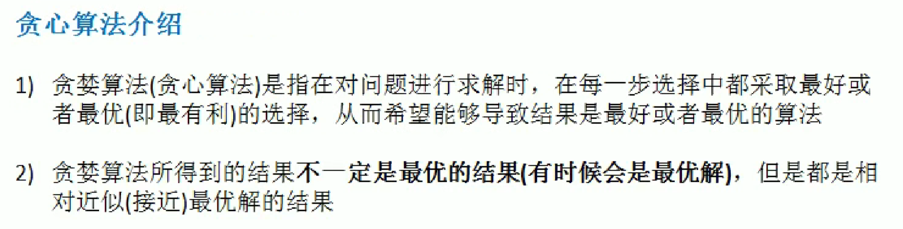
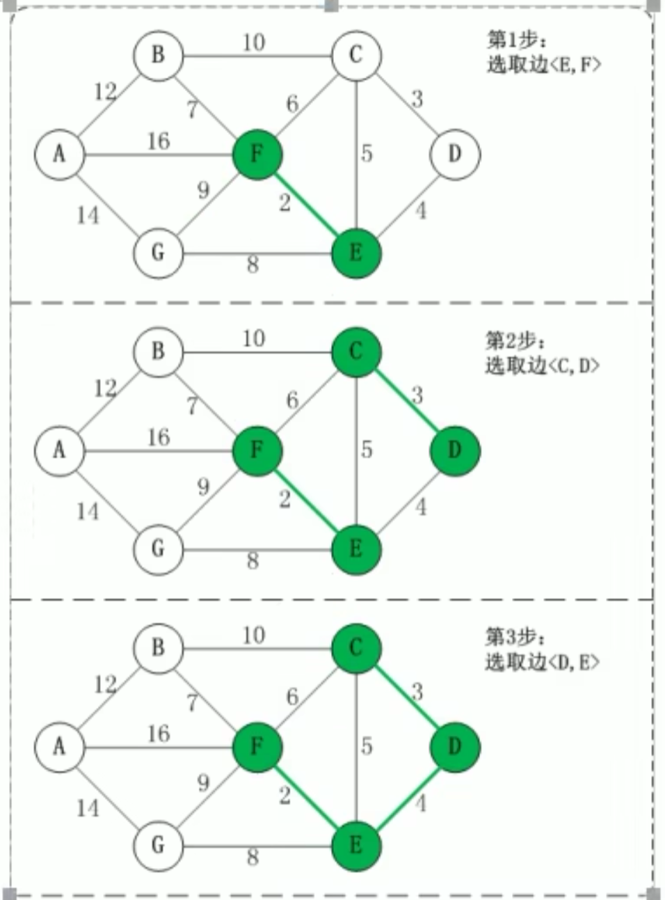

## 1.二分查找

## 2.分治算法

**应用案例**

### 汉诺塔

## 3.动态规划

**基本结束**

**实践案例**

### 背包问题

## 4.KMP算法(que)

**案例**

### 字符串匹配

>str1 = "java java 学习java java学习 学习好java java好学习"
>
>str2 = " 学习java java学习";
>
>返回 str2第一次出现的位置， 没有返回-1；

[KMP算法参考资料](https://www.cnblogs.com/zzuuoo666/p/9028287.html " kmp")

## 5.贪心算法

**基本介绍**

### 集合覆盖问题

## 6.Prim算法

**基本介绍**

>普利姆算法，也被称为Prim算法，是图论中的一种算法，主要用于在**加权连通图中搜索最小生成树**。该算法由捷克数学家沃伊捷赫·亚尔尼克在1930年首次发现，随后在1957年由美国计算机科学家罗伯特·普里姆独立发现，因此也被称为普里姆算法或普里姆－亚尔尼克算法。在某些场合，它还被称为DJP算法。该算法的核心思想是通过贪心策略逐步构建最小生成树。

**应用案例**

### 最小生成树(修路)问题

## 7.Kruskal 算法

**基本介绍**

>克鲁斯卡尔算法（Kruskal algorithm）是求连通网的最小生成树的一种经典算法，尤其在处理边稀疏的网时表现出色。
>
>克鲁斯卡尔算法的基本思想是从一个只包含所有顶点但不包含任何边的非连通图开始，按照边的权值从小到大的顺序选择边，并添加到图中，但保证不形成回路，直到所有顶点都连通为止。这样形成的图就是原连通网的最小生成树。	

### 最小生成树(公交站)问题

  
    
    

根据前面介绍的克鲁斯卡尔算法的基本思想和做法,我们能够了解到,克鲁斯卡尔算法重点需要解决的以下两个问题：

问题一 对图的所有边按照权值大小进行排序。
问题二 将边添加到最小生成树中时,**怎么样判断是否形成了回路**。

问题一很好解决,采用排序算法进行排序即可。
问题二,处理方式是:记录顶点在"最小生成树"中的终点,顶点的终点是"在最小生成树中与它连通的最大顶点"。
然后每次需要将一条边添加到最小生存树时,判断该边的两个顶点的终点是否重合,重合的话则会构成回路。

 

**并查集（Union-Find）** 了解一下

## 8.Dijkstra(迪杰斯特拉)算法

**基本介绍**

>迪杰斯特拉(Dijkstra)算法是典型最短路径算法,用于计算一个结点到其他结点的最短路径。
>它的主要特点是以起始点为中心向外层层扩展(广度优先搜索思想),直到扩展到终点为止。

应用场景

### 最短路径问题

